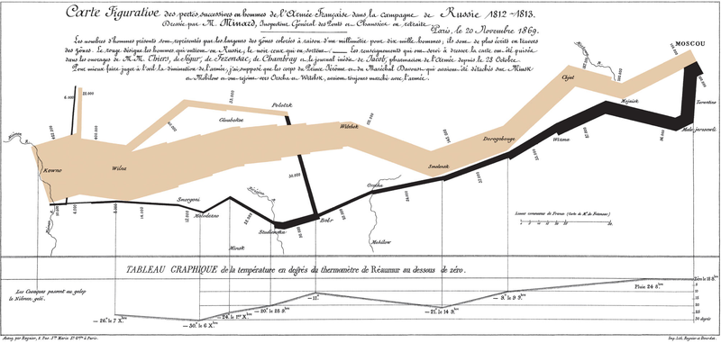

# Visualizations
This repo includes some of my works involving visualization.

### Napoleon's Russian Campaign visualization (2023)
Visualization of Napoleon's Russian Campaign based on the Minard's map, using troop, city nad temperature data. 

<!-->

     

          
     

     

          
     

</-->

Original|My visualization
-|-
|

### UK road accidents visualization (2023)
Visualization of UK road accidents based 2018 data.

### High dimensional function visualization (2021)
Visualization of high dimensional function using ParaView, including [test functions](https://en.wikipedia.org/wiki/Test_functions_for_optimization), [Compactly Supported Radial
Basis Function](https://en.wikipedia.org/wiki/Radial_basis_function) [(CSRBF)](http://www.math.iit.edu/~fass/603_ch4.pdf) [surrogate model](https://en.wikipedia.org/wiki/Surrogate_model), and potential energy of [toy proteins](https://www.princeton.edu/~fhs/fhspapers/fhspaper208.pdf).

  | 
 -|-
3D Rosenbrock | 3D Styblinski-Tang
|
4D Styblinski-Tang (4th dimension fixed at [-5, -2.903534, 0, 2.903534, 5])|CSRBF $\psi_{3,1}$ surrogate of 4D Styblinski-Tang (scaling factor, a = 10; data points, n = 1000)
|
Potential energy of toy protein AAAAA |Potential energy of toy protein AABBB
|
Potential energy of toy protein ABABAB | 
| 

