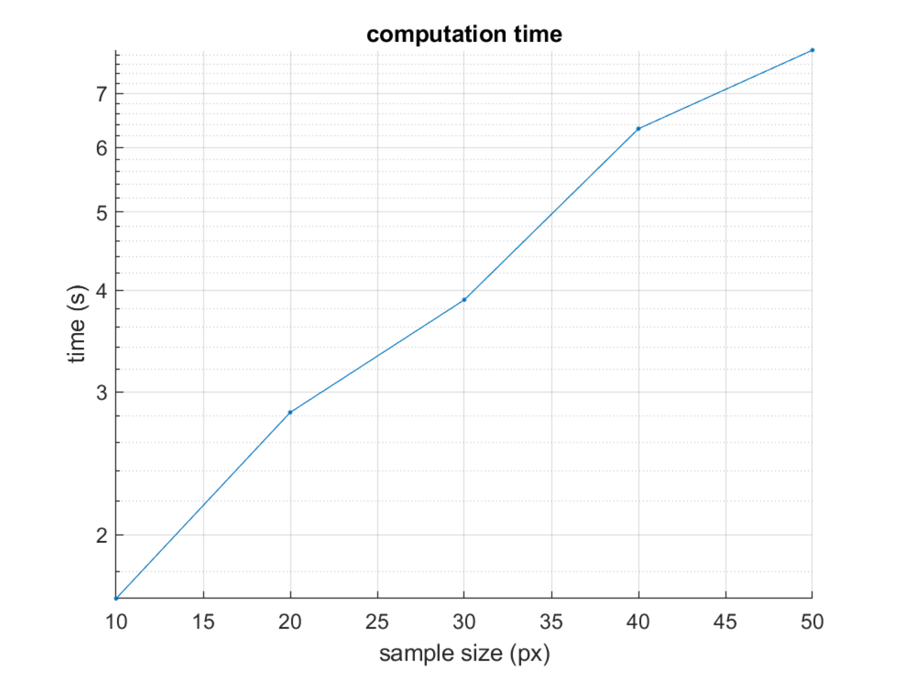

# Visualizations
This repo includes some of my works involving visualization.

### Napoleon's Russian Campaign Visualization (2023)
Visualization of Napoleon's Russian Campaign based on the Minard's map, using troop, city nad temperature data. 

  | 
-|-
Original|
My visualization|

### UK Road Accidents Visualization (2023)
Visualization of UK road accidents based 2018 data.

### Image Recovery Using Compressive Sensing (2022)
This project uses inverse discrete cosine transform and
orthogonal matching pursuit to recover a “damaged” image. The
image is divided into numbers of K×K small blocks to speed up
the computation, and data are sparse sampled from them. Then
the blocks are recovered, stitched together. 
Recovered image with different sample size|Sample size vs. computation time
-|-
|
Sample size vs. MSE for different methods|Entropy vs. MSE for different sample size
|
Findings: as the sample size increase, the computation cost would increase exponentially and the MAE would decrease exponentially in general; as the entropy of each block increase, the MSE increases exponentially and the trial with lower sample size would always have higher MSE in general. This also mean the more complex images (signals) are harder to recover from sparse samples.

### EEG Classification (2022)
This project uses the interior point method to train a support
vector machine (SVM) using  k-fold cross-validation to classify a dataset of
electroencephalogram (EEG) signals with binary labels. The
optimal weight is found by using the Newton method and line
search. 

$$
\begin{aligned}
 \underset{\mathbf{W, C, \xi}}{\min} & \hspace{2mm} \sum \xi_i + \lambda W^T W\\
 \text{S.T.} & \hspace{2mm} y_i (\mathbf{w}^T \mathbf{x}_i + b) \geq 1 \\
    & \hspace{2mm} \xi_i \geq 0 \\
& \hspace{2mm} (i = 1, 2, \dots, N) \\
\end{aligned}
$$

Data: object moving left or right on screen; 2 classes, 120 trails each, 204 channels; imagined or with actual moving object

|Imagined|Overt
-|-|-
Penalty Weight $\lambda$ vs. Accuracy||
ROC curve for each fold||
Weights $W$ and magnitude (most sig 5 ch are marked)||
2D plot of the magnitude of weights $W$||
|Plot of 5 most significant channels of weights $W$|Search the optimal $\lambda$
||
Findings: Classification accuracy using overt data is only 3.6% higher than imagined data at 94.9% with $\lambda = 10$; by using grid search the optimal $\lambda$ is found to be around 6.5; the most significant channels for overt data are channel 137, 141, and 155, which means they can be strongly related to vision and direction

### High Dimensional Function Visualization (2021)
Visualization of high dimensional function using ParaView, including [test functions](https://en.wikipedia.org/wiki/Test_functions_for_optimization), [Compactly Supported Radial
Basis Function](https://en.wikipedia.org/wiki/Radial_basis_function) [(CSRBF)](http://www.math.iit.edu/~fass/603_ch4.pdf) [surrogate model](https://en.wikipedia.org/wiki/Surrogate_model), and potential energy of [toy proteins](https://www.princeton.edu/~fhs/fhspapers/fhspaper208.pdf).

  | 
 -|-
3D Rosenbrock | 3D Styblinski-Tang
|
4D Styblinski-Tang (4th dimension fixed at [-5, -2.903534, 0, 2.903534, 5])|CSRBF $\psi_{3,1}$ surrogate of 4D Styblinski-Tang (scaling factor, a = 10; data points, n = 1000)
|
Potential energy of toy protein AAAAA |Potential energy of toy protein AABBB
|
Potential energy of toy protein ABABAB | 
| 

### 

